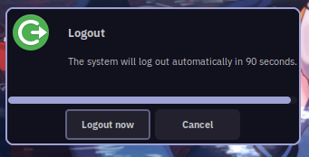

# SYSTEMACT

A logout / power menu backend that does the heavy lifting so that you can simply implement your
logout menu in whatever UI toolkit you want and simply leverage this to support the widest variety
of setups.

## Features:

- Configurable: you can adapt systemact to your setup by configuring the following settings.
  - logout command: change the command to whatever you want if you got a very custom setup.
  - lock command: using something like slock? not even a problem.
  - suspend method: from the good old suspend to hybrid sleep and suspend then hibernate fully
    supported.

- Extensible: systemact is not limited to just configuring a logout command, lock command or the
              suspend method, you the user can also completely override the functions for lock,
              logout, poweroff, reboot, suspend, hibernate, hybrid-sleep and suspend-then-hibernate
              with your own custom functions, commands and scripts if you need any additional hooks
              to run along those actions.

- Reduces work: it provides confirmation dialogs for shutdown, reboot, suspend and logout.

- Minimal: very few dependencies.
  - readlink    - coreutils.
  - mkdir       - coreutils.
  - cp          - coreutils.
  - gettext     - gettext.
  - notify-send - libnotify.
  - yad         - yad.
  - /bin/sh     - any posix compatible shell interpreter.

- Just Works™: sane defaults that cover most setups.

- Init freedom: using systemd or not is not an issue, systemctl and loginctl are both supported, not
                to mention we also have support for consolekit out of the box and if that is not
                enough you can overwrite the functions however you need for your setup.
